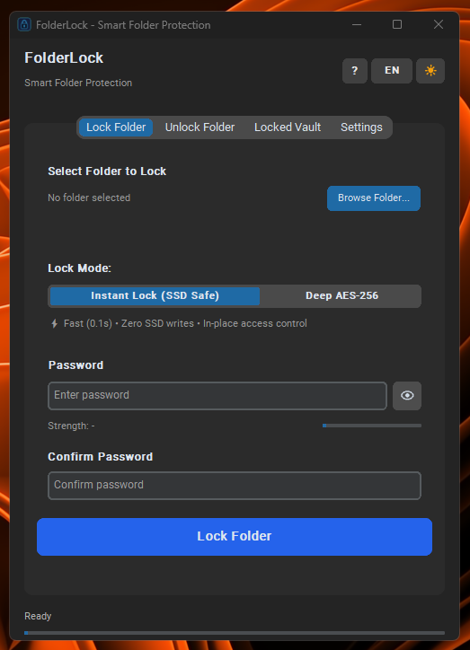

# FolderLock 🔒

> A lightweight Windows desktop utility for locking folders quickly or protecting them with AES-256-GCM encryption.

[](https://www.microsoft.com/windows)
[](LICENSE)
[](https://www.python.org/)
[](https://en.wikipedia.org/wiki/Galois/Counter_Mode)

<p align="center">
  
</p>

## Highlights

- **Instant Lock (SSD-friendly):** protects a folder without rewriting the protected file contents. FolderLock moves entries into an internal container and applies Windows hidden/system attributes plus an NTFS deny ACE.
- **Deep AES-256-GCM:** streams the folder into an encrypted vault using AES-256-GCM with a key derived from the password via PBKDF2-HMAC-SHA256 (300,000 iterations).
- **One-click re-lock:** after unlocking, FolderLock can place a local `Lock.exe` helper in the folder for quick re-locking.
- **Portable unlock helper:** when running as a compiled executable, FolderLock can place `Unlock.exe` in a locked folder.
- **English + Turkish UI:** runtime language switching with persistent preferences.
- **Light + dark themes:** follows the Windows appearance setting on first launch and remembers later choices.
- **Windows shell integration:** optional per-user Explorer integration through `HKEY_CURRENT_USER`.

## Protection Modes

| Feature | Instant Lock | Deep AES-256-GCM |
| --- | --- | --- |
| Main goal | Fast local access restriction | Cryptographic confidentiality + integrity |
| Protected file contents rewritten? | No | Yes, into an encrypted vault |
| Mechanism | Hidden/system attributes + NTFS deny ACE | PBKDF2-HMAC-SHA256 + AES-256-GCM |
| Best for | Large folders, games, media, everyday local privacy | Sensitive documents and data requiring encryption |
| Unlock cost | Very fast; mostly filesystem metadata operations | Depends on data size and storage/CPU performance |

> **Important:** Instant Lock is **not encryption**. A Windows administrator, a user who takes ownership/changes ACLs, or someone accessing the drive offline may be able to bypass NTFS permission-based protection. Use **Deep AES-256-GCM** when the data itself must remain confidential.

## How It Works

### Instant Lock

FolderLock creates an internal `.locked_data` directory, stores password-verification metadata in `.flock_meta`, moves the selected folder's contents into that directory, then applies hidden/system attributes and a deny ACE using the language-independent Windows SID `*S-1-1-0` (`Everyone`).

This avoids rewriting the protected payload files, which is why it is suitable for very large folders. The operation still performs normal filesystem metadata writes and may create small FolderLock helper/metadata files, so it should not be described as literally writing zero bytes to disk.

### Deep AES-256-GCM

FolderLock packages the folder contents into a streaming archive and encrypts that stream into `.locked_vault`. The encryption key is derived from the password with PBKDF2-HMAC-SHA256 using a random 32-byte salt and 300,000 iterations. AES-256-GCM provides authenticated encryption so corrupted or modified ciphertext is detected during decryption.

Before plaintext data is removed, FolderLock verifies that the newly created encrypted vault can be authenticated with the supplied password.

## Password & Re-lock Behavior

- Folder passwords are not hard-coded in the repository.
- Instant Lock stores a salted password-derived verifier, not the plaintext password.
- For one-click re-lock in **Deep AES mode**, FolderLock may store the password in `.flock_relock` protected with the current Windows user's DPAPI credentials while the folder is unlocked.
- DPAPI-protected re-lock data is tied to the Windows security context that created it; it should be treated as a convenience feature rather than a portable secret store.

## Security Scope

FolderLock uses standard Windows access-control mechanisms and the `cryptography` package's AES-GCM implementation. The project has **not been presented as independently security-audited**, so highly sensitive or regulated data should still be backed up and handled with an established, audited encryption solution where appropriate.

## Building from Source

### Requirements

- Windows 10 or Windows 11
- Python 3.10+
- `pip`

### Install

```bash
git clone https://github.com/canyrtcn/FolderLock.git
cd FolderLock
pip install -r requirements.txt
```

### Run

```bash
python main.py
```

### Build a Windows executable

```bash
pyinstaller FolderLock.spec --clean
```

The executable is generated under `dist/`.

## Kullanım Kılavuzu (Türkçe)

1. **Klasör kilitleme**
   - **Klasör Seç** ile klasörü belirleyin.
   - Bir şifre oluşturun.
   - **Hızlı Kilit (SSD Dostu)** veya **Tam AES-256** modunu seçin.
   - **Klasörü Kilitle** düğmesine basın.

2. **Kilit açma**
   - Ana uygulamadaki **Kilit Aç** / **Kilitli Kasam** bölümünü kullanabilirsiniz.
   - Derlenmiş sürümde klasör içine yerleştirilen `Unlock.exe` üzerinden de şifre girerek kilidi açabilirsiniz.

3. **Tek tıkla tekrar kilitleme**
   - Kilit açıldıktan sonra klasöre yerleştirilen `Lock.exe` ile aynı klasörü hızlıca tekrar kilitleyebilirsiniz.

### Mod seçimi

- **Hızlı Kilit:** Dosya içeriklerini yeniden yazmadan NTFS erişim kısıtlaması uygular. **Şifreleme değildir.**
- **Tam AES-256:** Dosya içeriğini AES-256-GCM ile şifreli kasaya dönüştürür. Hassas veri için tercih edilmesi gereken mod budur.

## Project Structure

```text
main.py                # Main CustomTkinter application
crypto_engine.py       # Instant-lock and AES-GCM protection logic
config_manager.py      # User settings and local vault registry
shell_integration.py   # Windows Explorer integration
translations.py        # English/Turkish strings
ui_dialogs.py          # Dialog windows
ui_icons.py            # Runtime-generated UI icons
FolderLock.spec        # PyInstaller configuration
```

## License

Licensed under the [MIT License](LICENSE).
